## Hamburgueria

- O projeto consiste em uma interface de uma lanchonete online. O projeto foi inspirado pelo serviço [**Menu Dino**](https://www.consumer.com.br/menudino?gclid=CjwKCAjws8yUBhA1EiwAi_tpEQxqANzVBIHTgn3di9TWa8a6NmcZeX64-J4qBcy1U6QzQ0vbpzEOoRoC1CEQAvD_BwE), oferecido pela companhia Consumer, que oferece serviços para empresas do ramo alimetício, incluindo a possibilidade de possuírem um e-commerce de seus produtos.

## Sumário

- [Tecnologias utilizadas](#tecnologias)
- [Instruções para rodar o projeto](#instrucoes)
- [Organização e estruturação do projeto](#organizacao)
- [Desenvolvimento](#desenvolvimento)
- [Imagens](#imagens)

## Tecnologias Utilizadas <a name="tecnologias"></a>

- [**React**](https://pt-br.reactjs.org/)
- [**React Hooks**](https://pt-br.reactjs.org/docs/hooks-intro.html)
- [**Styled Components**](https://styled-components.com/)
- [**React Icons**](https://react-icons.github.io/react-icons/)
- [**Redux Toolkit**](https://redux-toolkit.js.org/)
- [**React Redux**](https://react-redux.js.org/)
- [**React Accessible Accordion**](https://github.com/springload/react-accessible-accordion)
- [**React Scroll**](https://github.com/fisshy/react-scroll)
- [**React Router Dom**](https://v5.reactrouter.com/web/guides/quick-start)
- [**Axios**](https://github.com/axios/axios)

## Instruções para rodar o projeto <a name="instrucoes"></a>

### Será necessário ter instalado na sua máquina:

```
Git
React
Vite
```

- Clone o repositório com o comando **git clone**:

```
git clone https://github.com/felipehimself/hamburgueria-reactjs.git
```

- Entre no diretório que acabou de ser criado:

```
cd hamburgueria-reactjs
```

- Para o projeto funcionar na sua máquina, será necessário instalar suas dependências, para isso, utilize o comando:

```
npm install
```

- Pronto, agora o projeto está pronto para ser rodado localmente, utilizando o comando **npm run dev**:

```
npm run dev
```

## Organização e estruturação do projeto <a name="organizacao"></a>

O projeto está organizado e estruturado da seguinte forma:

```
───src
    │   App.tsx
    │   favicon.svg
    │   main.tsx
    │   vite-env.d.ts
    │
    ├───assets
    │       header-background.jpg
    │       logo.png
    │
    ├───components
    │   ├───Accordion
    │   │       AccordionCard.tsx
    │   │       AccordionContainer.tsx
    │   │       styles.ts
    │   │
    │   ├───Cart
    │   │   │   CartSummary.tsx
    │   │   │   styles.ts
    │   │   │
    │   │   ├───CartBtnAdd
    │   │   │       CartBtnAdd.tsx
    │   │   │       styles.ts
    │   │   │
    │   │   └───CartBtnSend
    │   │           CartBtnSend.tsx
    │   │           styles.ts
    │   │
    │   ├───Header
    │   │       Header.tsx
    │   │       styles.ts
    │   │
    │   ├───Menu
    │   │       Menu.tsx
    │   │       styles.ts
    │   │
    │   ├───Modal
    │   │   │   Content.tsx
    │   │   │   Modal.tsx
    │   │   │   style.ts
    │   │   │
    │   │   ├───Order
    │   │   │       OrderOptions.tsx
    │   │   │       styles.ts
    │   │   │
    │   │   └───Working
    │   │           styles.ts
    │   │           WorkingHours.tsx
    │   │
    │   └───Topbar
    │       │   styles.ts
    │       │   Topbar.tsx
    │       │
    │       └───Input
    │               SearchInput.tsx
    │               styles.ts
    │
    ├───constants
    │       styles.ts
    │    
    ├───interfaces
    │       dataInterfaces.ts
    │
    ├───pages
    │       Cart.tsx
    │       Home.tsx
    │       index.tsx
    │
    ├───services
    │   ├───slices
    │   │       dataSlice.ts
    │   │       filterListSlice.ts
    │   │       modalOrderSlice.ts
    │   │       modalWorkingSlice.ts
    │   │       ordersSlice.ts
    │   │
    │   └───store
    │           store.ts
    │
    ├───shared
    │       Badge.tsx
    │       Container.tsx
    │       globalStyles.tsx
    │
    └───utils
            data.ts
```

## Desenvolvimento <a name="desenvolvimento" ></a>

### Estilização

Para realizar a estilização, foi utilizado:

- [**Styled Components**](https://styled-components.com/).

### Esquema de rotas

Para a implementação de rotas foi utilizado:

- [**React Router Dom**](https://v5.reactrouter.com/web/guides/quick-start)

### Gerenciamento de Estados

Para o gerenciamento de estados foram utilizados:

- [**Redux Toolkit**](https://redux-toolkit.js.org/)
- [**React Redux**](https://react-redux.js.org/)

### Requisições HTTP

Para realizar a requisição HTTP responsável por enviar os dados do pedido do cliente via bot do Telegram, foi utilizado:

- [**Axios**](https://github.com/axios/axios)

## Imagens <a name="imagens" ></a>

### Desktop

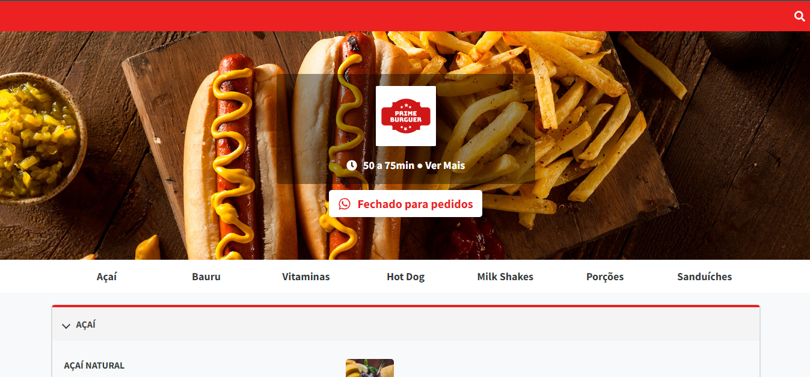 
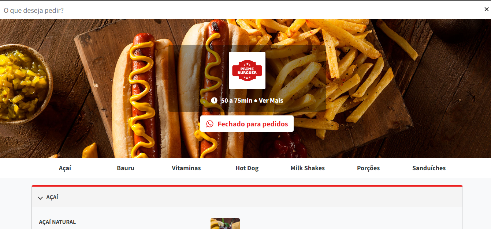 
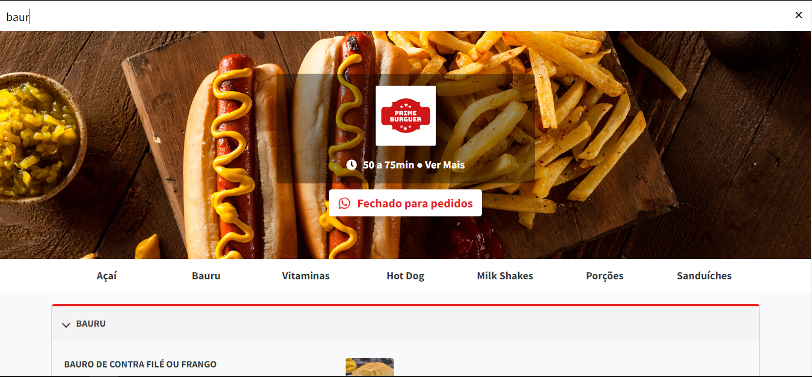 
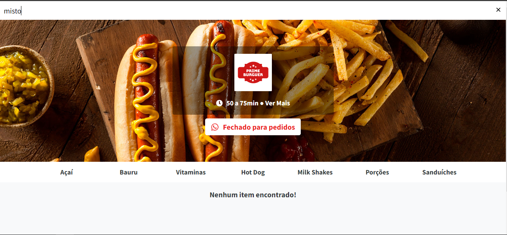 
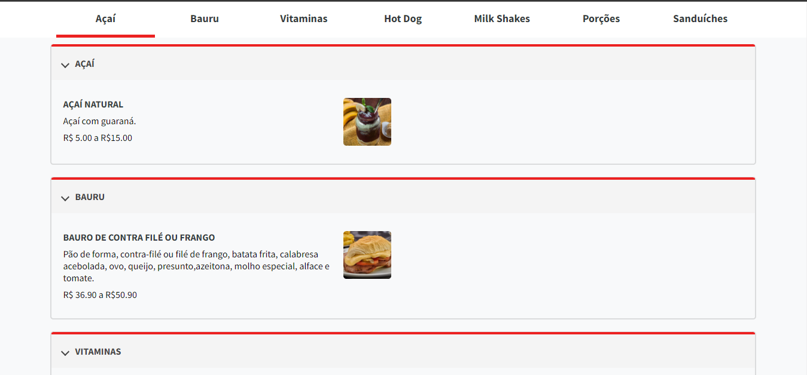 
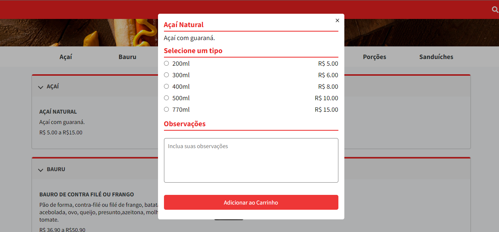 
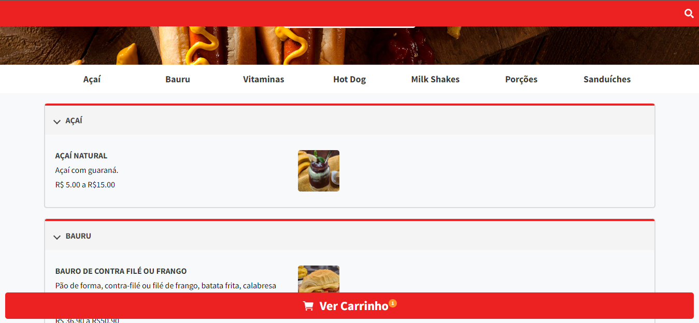 
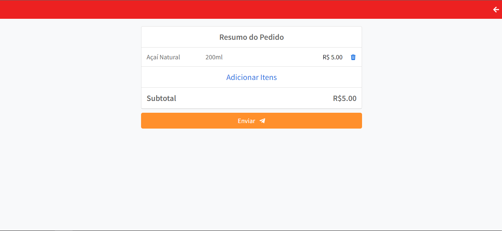

### Mobile

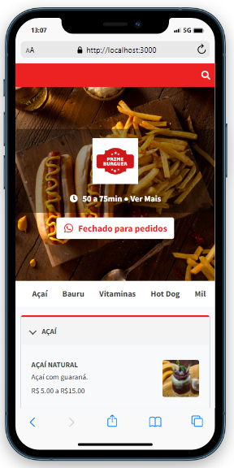 
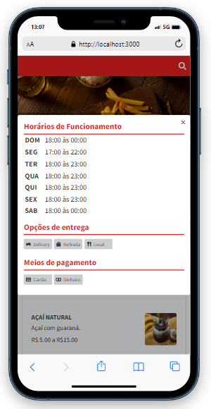 
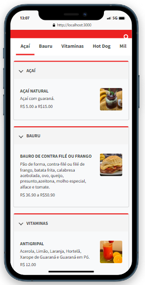 
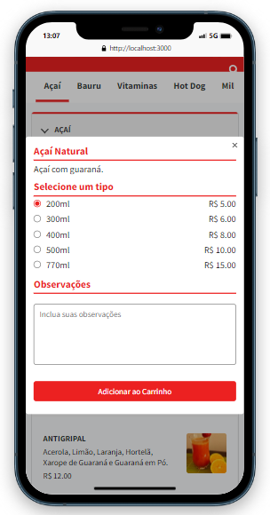 
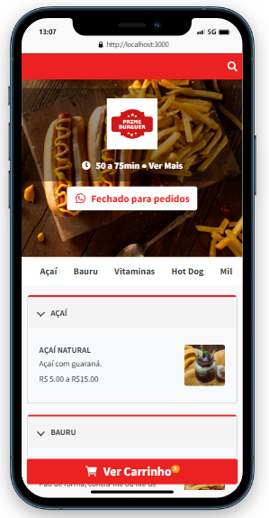 
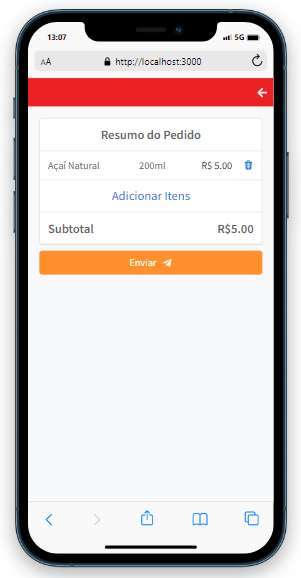
